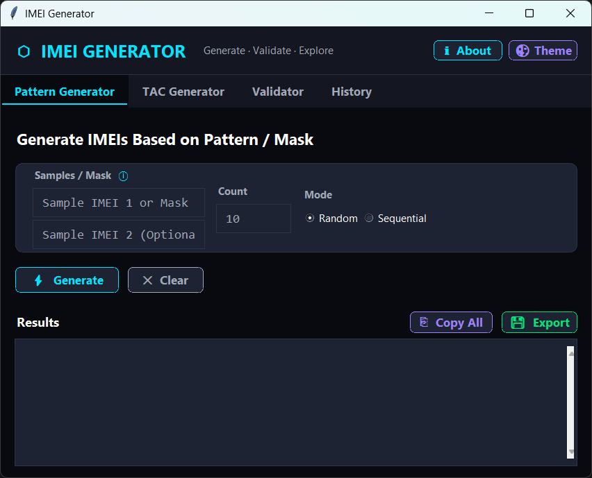
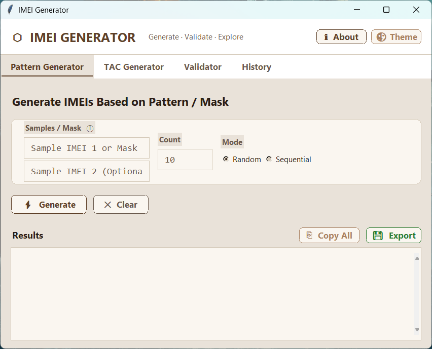

<div align="center">


[](https://www.python.org/)
[](https://opensource.org/licenses/MIT)
[](https://github.com/not-GIANT/IMEI-Generator/releases)
[]()
[]()

*Professional-grade desktop utility for generating, validating, and managing IMEI numbers.*

[**⬇ Download .exe**](https://github.com/not-GIANT/IMEI-Generator/releases) · [**📖 Installation**](#-installation) · [**📸 Screenshots**](#-screenshots)

</div>

---

## What Is This?

IMEI Generator Pro is a fully-featured desktop tool for generating and validating IMEI numbers to the ISO/IEC 7812-1 Luhn standard. It supports wildcard patterns, TAC-based generation, batch import/export, and runs a custom multi-threaded UI so it never freezes — even with 10,000+ entries.

> Built for developers, testers, and anyone who needs accurate, standards-compliant IMEI data at scale.

---

## ✦ Features

### 📡 Generation

| Mode | Description |
|---|---|
| **Pattern / Mask** | Use `X` as a wildcard — e.g. `35693803XXXXXX` generates IMEIs for a specific range |
| **TAC-Based** | Supply an 8-digit Type Allocation Code; the tool fills in valid suffixes |
| **Sequential** | Predictable ordered output — ideal for structured test data |
| **Random Batch** | Randomized generation with built-in collision detection for uniqueness |

### 🔍 Validation

| Feature | Detail |
|---|---|
| **Luhn Algorithm** | Full ISO/IEC 7812-1 checksum validation |
| **Duplicate Detection** | Real-time flagging of repeated IMEIs across large batches |
| **Live Analytics** | Running counters for Total / Valid / Invalid / Duplicate |

### 💾 Data Management

- **Import** from `.txt` or `.csv`
- **Export** to `.txt`, `.csv` (Excel-compatible), or `.json`
- **Session History** log for all generation and validation runs

### 🎨 Themes

| Theme | Description |
|---|---|
| **Cyber Dark** | High-contrast dark mode, built for focus |
| **Cream & Mocha** | Warm, low-strain palette for extended use |

---

## 📸 Screenshots

<div align="center">

| Cyber Dark | Cream & Mocha |
|:---:|:---:|
|  |  |
| *High-contrast, focused workflow* | *Soft tones for day-time use* |

</div>

---

## ⬇ Installation

### Option A — Standalone Executable *(Windows, zero setup)*

1. Go to [**Releases**](https://github.com/not-GIANT/IMEI-Generator/releases)
2. Download `imei_tool.exe`
3. Run it — no Python required

### Option B — Run from Source

**Prerequisites:** Python 3.8+

```bash
git clone https://github.com/not-GIANT/IMEI-Generator.git
cd IMEI-Generator
python imei_tool.py
```

---

## 🛠️ Tech Stack

| Layer | Technology |
|---|---|
| **Language** | Python 3.13 |
| **GUI** | Custom Tkinter framework with hand-crafted widgets |
| **Validation** | Luhn Algorithm — ISO/IEC 7812-1 |
| **Threading** | Multi-threaded execution (zero UI freeze) |
| **Packaging** | PyInstaller |

---

## 🗂️ Project Structure

```
IMEI-Generator/
├── imei_tool.py       ← Core application — generation, validation, UI
├── screenshots/       ← Theme screenshots
├── icon.ico           ← Windows application icon
├── icon.png           ← General icon asset
└── README.md
```

---

## 🗺️ Roadmap

- [ ] Linux / macOS support
- [ ] CLI mode for scripting and CI pipelines
- [ ] IMEI database lookup integration
- [ ] Custom TAC database import

---

<div align="center">

---

*Developed with ❤️ by [**GIANT**](https://github.com/not-GIANT)*

*Found it useful? Drop a ⭐*

</div>
